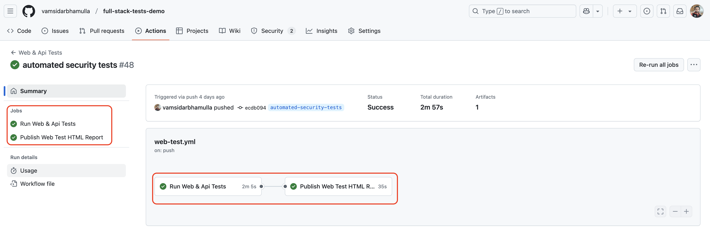
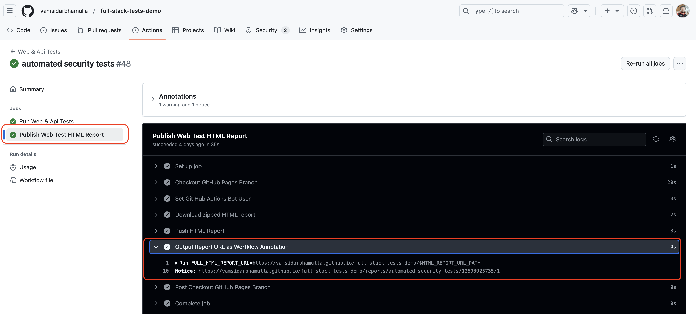
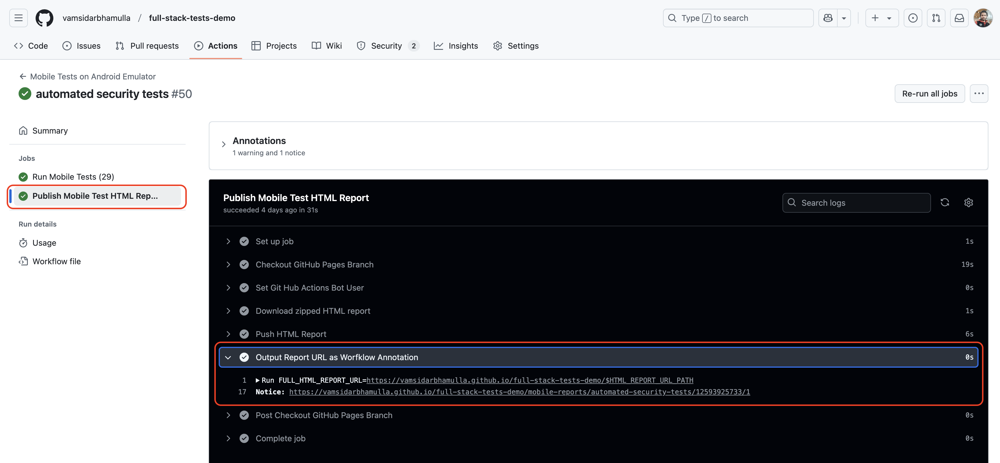
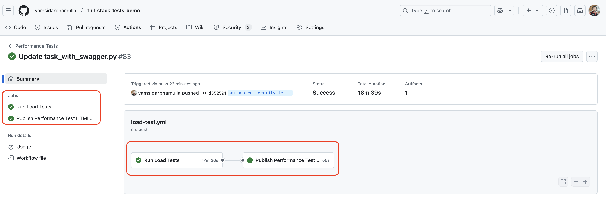
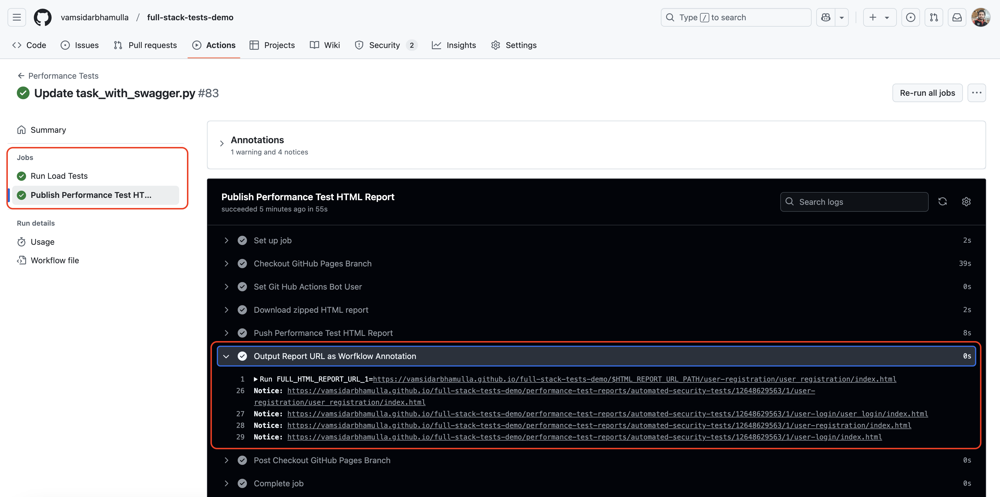
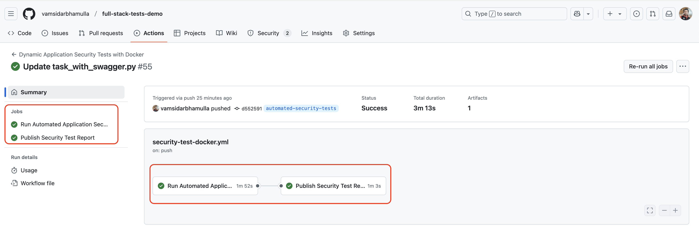
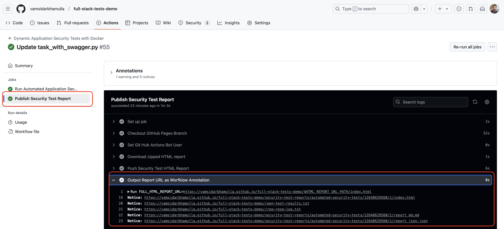

# Full-stack-tests-demo

This is a test automation repo with web, mobile, rest-api, performance and security testing.

##### Table of Contents
[0. repo-tour-videos](#repo-tour)<br />
[1. repo-structure](#repo-structure)<br />
[2. mobile-tests](./tests/mobile-tests/README.md)<br />
[3. web-tests](./tests/web-tests/README.md)<br />
[4. performance-tests](./tests/performance-tests/README.md)<br />
[5. security-tests](./tests/security-tests/README.md)<br />
[6. mobile-performance-tests](./tests/docs/mobile-performance-tests/README.md)<br />
[7. web-app-functional-test-observations](./tests/docs/web-app/Web-app-observations.md)<br />
[8. mobile-app-functional-test-observations](./tests/docs/mobile-app/Mobile-app-observations.md)<br /> 
[9. test-management](./tests/docs/test-management/README.md)<br />
[10. mobile-tests-results](https://vamsidarbhamulla.github.io/full-stack-tests-demo/mobile-reports/publish-mobile-n-load-test-report/12531729051/1/)<br />
[11. web-tests-results](https://vamsidarbhamulla.github.io/full-stack-tests-demo/reports/main/12523798224/1/)<br />
[12. performance-tests-results](https://vamsidarbhamulla.github.io/full-stack-tests-demo/performance-test-reports/5/merge/12532453822/1/user-login/user_login/index.html)<br />
[13. security-tests-results](https://vamsidarbhamulla.github.io/full-stack-tests-demo/security-test-reports/automated-security-tests/12648545019/1/index.html)<br />
[14. mobile-tests-results-screenshots](./tests/mobile-tests/docs)<br />
[15. web-tests-results-screeshots](./tests/web-tests/docs)<br />
[16. performance-tests-results-screenshots](./tests/performance-tests/docs)<br />
[17. security-tests-results-screenshots](./tests/security-tests/docs)<br />
[18. all-automation-tests-results](https://github.com/vamsidarbhamulla/full-stack-tests-demo/tree/gh-pages)<br />
[19. pipeline-tests-results](#pipeline-reports)<br />

[](https://github.com/vamsidarbhamulla/full-stack-tests-demo/actions/workflows/mobile-test.yml) | [](https://github.com/vamsidarbhamulla/full-stack-tests-demo/actions/workflows/web-test.yml)<br />

[](https://github.com/vamsidarbhamulla/full-stack-tests-demo/actions/workflows/load-test.yml)  |  [](https://github.com/vamsidarbhamulla/full-stack-tests-demo/actions/workflows/load-test-docker.yml)<br />

[](https://github.com/vamsidarbhamulla/full-stack-tests-demo/actions/workflows/security-test-docker.yml)<br />

<a name="repo-tour"></a>

## repo tour 
[1.0 Repo Explanation](https://www.loom.com/share/0e6ca6f8aa6248d19393e3f57f919951)<br />
[2.0 Web-Api-Mobile-Automation-Tests](https://www.loom.com/share/185dceb7f3cd4d28aa75c0d2fccdaaf2)<br />
[3.0 Performance-Security-Automation-Tests](https://www.loom.com/share/4acdcfc0950f4f2bac22e43727d7b684)<br />


<a name="repo-stucture"></a>

## repo structure 
The repo structure is shown below:
````
+ backend
    Python Flask Rest Api 
+ mobile-app
    + android 
        app for wikipedia sample    
+ tests
    + docs 
        + mobile-app
            - exploratory testing observations for wikipedia sample app
            - including bugs + screenshots
        + mobile-performance-tests
            - apptim desktop performance test-results
        + test-management
            - 5 different scenarios detailed test approach 
        + web-app
            - exploratory testing observations for owasp web app
            - including bugs + screenshots
    + mobile-tests
        - webdriverio + nodejs + appium + typescript automated tests
        - tests run against wikipedia sample android app
    + performance-tests
        - k6 + xk6 + xk6-sqlite3 driver + load tests
        - load test run against python+flask+rest-api backend client registration endpoint
        - stress test run against python+flask+rest-api backend client login endpoint  
    + security-tests 
        - security vulnerabilities listed for python+flask+rest-api backend
        - shell script to run the tests 
        - results text file that capture script execution 
    + web-tests 
        - playwright + nodejs + typescript automated tests
        - tests run against owasp juice shop sample web-app   
+ web-app
    owasp juice shop web-app
    shell script to start a clean docker container for owasp juice shop
````

<a name="pipeline-reports"></a>

## Test-Pipeline-Job-reports

1. Each Test Type has a specific github action run pipeline job 

2. Each pipeline test run job followed by a published report job 

3. These published reports are served from gh-pages branch that is being pushed to gh-pages branch using github-bot username and with a valid commit message

4. To access the exact test run report access the links specific to test job 
    
    a. Access the specific published html report job <br />
    b. From the step: Output Report URL as Workflow Annotation <br />
    c. You will be able to get the latest test run report url<br />
    d. Reference screenshots provided below <br />

**Screenshots**: 

***1. Web-Tests-Pipeline-Reports*** 
<br /><br /> 
<br /><br /> 

***2. Mobile-Tests-Reports***
<br /><br /> 
<br /><br /> 

***3. Performance-Tests-Reports***
<br /><br /> 
<br /><br /> 

***4. Security-Tests-Reports***
<br /><br /> 
<br /><br /> 