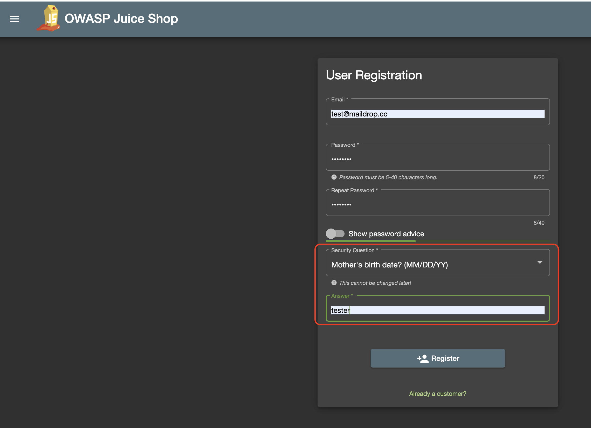

**Title**: Security Answer Field Accepts Non-Date Input for Date Security Question in User Registration Form

**Description**: The user registration form allows any text to be entered in the security answer field, even when the security question is specifically asking for a date. This could lead to inconsistent and potentially insecure user data.

**Steps to Reproduce**:
1. Navigate to the user registration form on the application.
2. Select a security question dropdown option that asks for "Mother's birth date" or "Father's birth date"
3. Enter any non-date text (e.g., "abc123") in the security answer field.
4. Submit the registration form.

**Expected Result**: The form should validate the input and only accept date formats (e.g., "MM/DD/YYYY") for security questions that require a date.

**Actual Result**: The form accepts any text input in the security answer field, regardless of the security question type.

**Environment**:
- Device: MacBook Pro 
- OS: MacOs
- Browser: Chrome
- OWASP Juice Shop Version: V17.1.1

**Additional Information**:
- The issue persists across different browsers and devices.
- No error messages or validation warnings are displayed.
- This issue could lead to security vulnerabilities as incorrect data is accepted.

**Workaround**: None identified. Users can input any text, leading to potential security issues.

**Severity**: Medium - This issue affects the security and consistency of user data.

**Priority**: High - Immediate attention required to enforce proper input validation and ensure data security.

**Screenshots/Videos**: 
