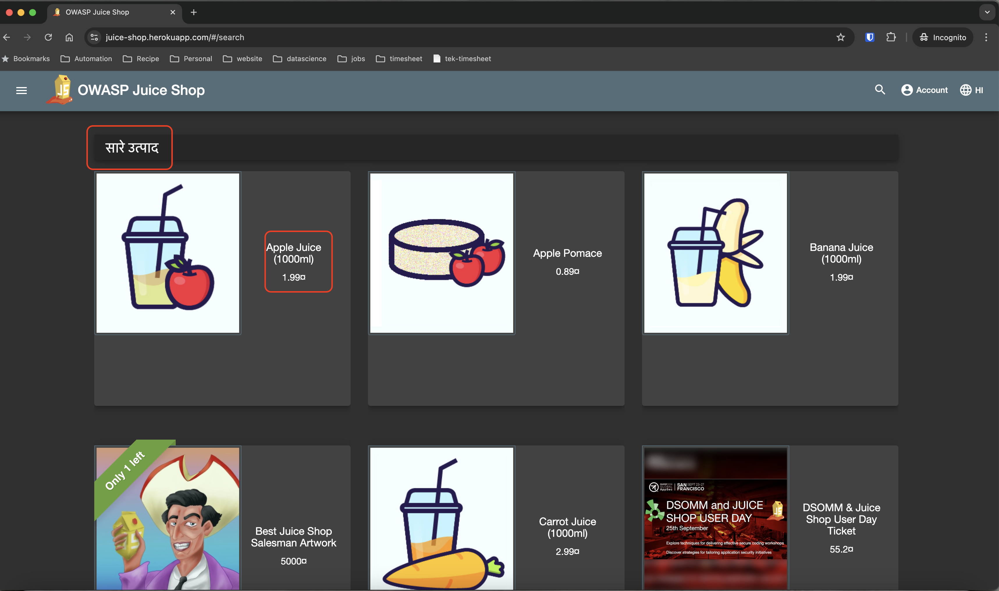
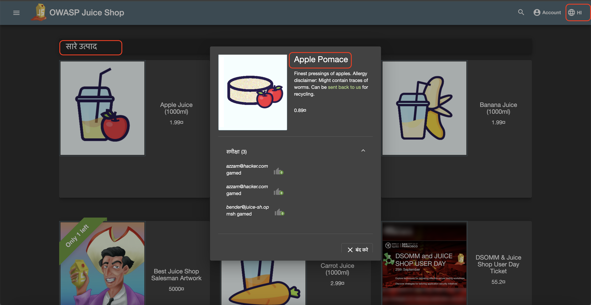
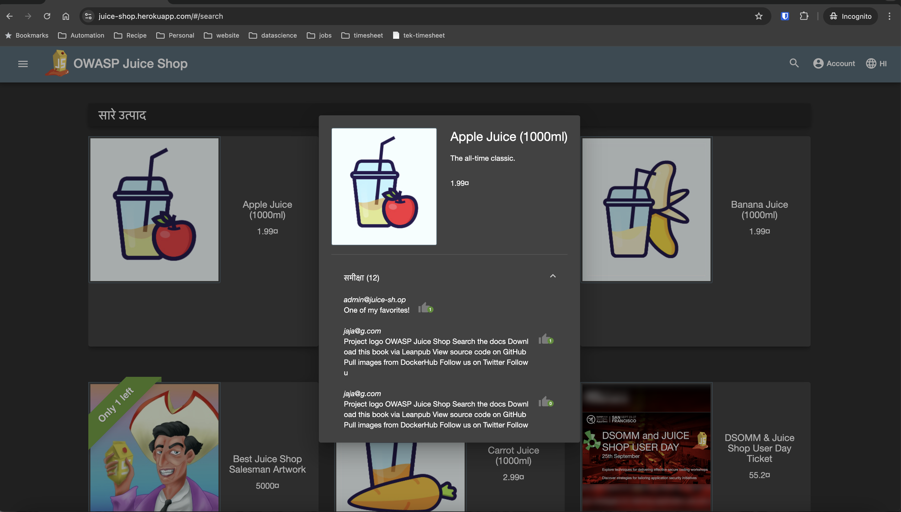

**Title**: Localization Issues - Language Selection Doesn't Update OWASP Juice Shop Home Page Except "All Products" Keyword on the Top

**Description**: When changing the language setting to Hindi or any other language in the OWASP Juice Shop app, the individual tiles do not update their content. Only the "All Products" keyword in the top div is translated.

**Steps to Reproduce**:
1. Open the OWASP Juice Shop application.
2. Click on the Lanaguage settings icon on the top right header bar and change the language to Hindi (or any other non-default language).
3. Navigate to the product listing page.
4. Observe the content in the individual product tiles.

**Expected Result**: The content within each product tile should be translated to the selected language, including product names, descriptions, and other details.

**Actual Result**: The content within each product tile remains in the default language. Only the "All Products" keyword in the top div is translated to the selected language.

**Environment**:
- Device: MacBook Pro 
- OS: MacOs
- Browser: Chrome
- OWASP Juice Shop Version: V17.1.1

**Additional Information**:
- The issue shows up on Other places such as product tile popup product name and the review comments on the apple juice or any other selected product/item tile. 
- The issue persists even different languages and devices.
- Refreshing the page does not resolve the issue.
- The application was updated to the latest version before the issue was noticed.

**Workaround**: None identified. Users cannot view translated content in individual product tiles.

**Severity**: Medium - This issue affects the usability and accessibility of the app for non-English speakers.

**Priority**: High - Addressing this issue is important to ensure proper localization and enhance user experience.

**Screenshots/Videos**: 

