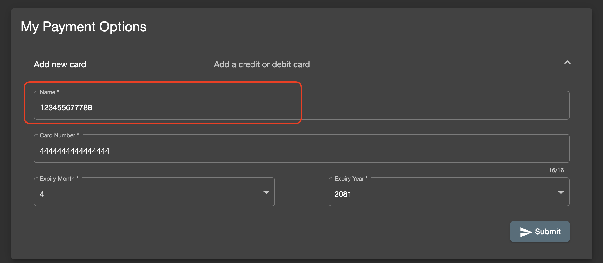
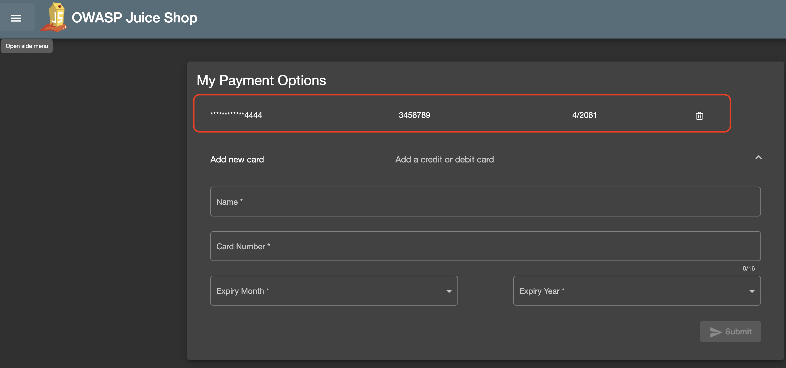

**Title**: Credit Card Name Field Accepts Numbers and Special Characters

**Description**: The credit card name field in the payment option section of the application allows users to input numbers and special characters. This field should only accept alphabetic characters to ensure valid credit card names are entered.

**Steps to Reproduce**:
1. Login to OWASP juice Shop with a valid account
2. Navigate to the user account payment option section of the application.
3. Select the add new credit card payment method.
4. Enter a name in the credit card name field that includes numbers and special characters (e.g., "John123 Doe!").
5. Added credit cards shown with numbers in the credit card name.

**Expected Result**: The credit card name field should validate the input and only accept alphabetic characters. It should show an error message if numbers or special characters are entered.

**Actual Result**: The credit card name field accepts input with numbers and special characters without any validation or error message.

**Environment**:
- Device: MacBook Pro 
- OS: MacOs
- Browser: Chrome
- OWASP Juice Shop Version: V17.1.1

**Additional Information**:
- The issue persists across different devices and browsers.
- No validation errors are shown, and the credit card successfully added
- Newly added credit card can be used to make payments with invalid names.
- The application was updated to the latest version before the issue was noticed.

**Workaround**: None identified. Users can enter invalid names, potentially leading to payment processing issues.

**Severity**: Medium - This issue affects the correctness of credit card information and could lead to payment failures.

**Priority**: High - Immediate attention required to implement input validation and ensure the credit card name field only accepts alphabetic characters.

**Screenshots/Videos**: 

